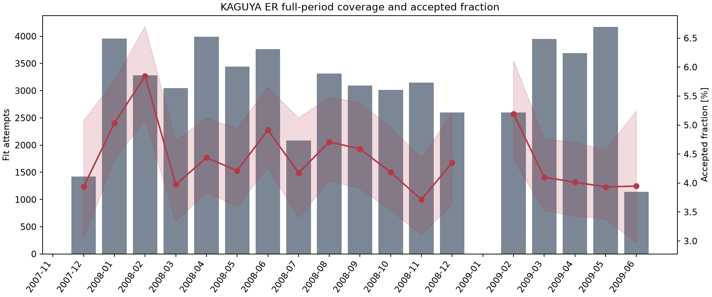
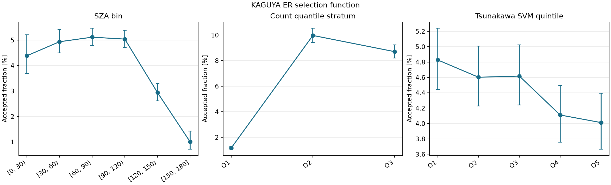
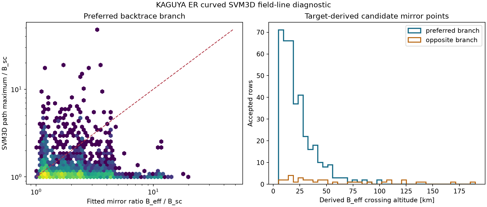

# Full-Period Electron-Reflectometry Validation

This report validates the fixed KAGUYA/PACE variant
`robust_counts_v2_600s_p16_e78a09b2d1c7` as of 2026-08-23. It covers the path
from raw ESA1 counts to `mirror_ratio` and `effective_field`. Read the
[estimation algorithm](electron-reflectometry-algorithm.md) first for the
physical assumptions and likelihood.

!!! danger "Verdict first"
    The archive and estimator are **mechanically reproducible**. Blinded
    re-review, ESA1/ESA2 replication, short-cadence persistence, and comparison
    with an independent crustal-field model are nevertheless insufficient or
    negative for treating current `good + review` rows as robust lunar-surface
    field measurements. The output remains a `status="candidate"` catalog of
    **loss-cone-like edges**. Do not use it as a surface-field map, event count,
    or absolute-accuracy reference.

## 1. What validation means here

"The code works" and "the physical quantity is measured correctly" are
different claims. This report separates five levels:

| Level | Question | Result |
| --- | --- | --- |
| Archive integrity | Are files, times, equations, and provenance internally consistent? | Confirmed |
| Numerical reproducibility | Does the same raw input reproduce the same fit? | Confirmed |
| Statistical uncertainty | How tightly is each point estimate constrained? | Often broad; many truncated profiles |
| Internal replication | Does it persist across sensors, cadence, and blind review? | Negative |
| External physical validity | Does it track an independent lunar-field model? | Not demonstrated |

Passing all software checks therefore validates archive construction, not the
physical truth of `B_eff`. Conversely, weak external correspondence alone does
not prove that no edge exists in the count surface. The currently identified
estimand is the effective mirror field at the observation time under the
selected model assumptions.

## 2. Target and sampling

| Item | Fixed value |
| --- | --- |
| Requested interval | 2007-11-07 00:00 UTC inclusive to 2009-06-11 00:00 UTC exclusive |
| Requested days | 582 |
| Primary sensor | PACE ESA1 |
| Field and position | LMAG + SPICE |
| Sampling | Native record nearest the center of each 600 s bucket |
| Pitch | 16 bins over 0--180 degrees, paired and folded to 0--90 degrees |
| Likelihood | Exposure-aware beta-binomial |
| Models | `no_edge`, `mirror_only`, `electrostatic` |
| Selection | Nested BIC with a default improvement threshold of 6 |
| Primary accepted set | `quality_grade in {"good", "review"}` |
| Archive profile likelihood | Disabled; recomputed for every accepted row in a separate artifact |

!!! warning "Meaning of full period"
    Every day in the requested public-file interval was examined, but not every
    native record was fitted. A ten-minute row is one systematic record sample,
    not a ten-minute average or integration. Cadence sensitivity is tested
    separately below.

## 3. Results at a glance

| Validation | Main result | Interpretation |
| --- | --- | --- |
| Archive integrity | 473 shards, 55,702 rows, zero violations | Confirmed |
| Accepted-row refit | Grade, model, and point estimate reproduced for 2,470/2,470 | Confirmed |
| Profile 95% interval | Finite stored endpoints for all rows; 32.7% truncated by search range | Caution |
| Selection model | Combined AUC 0.548 for edge occurrence | Simple environment variables do not explain selection |
| Blinded re-audit | 58.2% binary agreement; kappa 0.074 | Low repeatability |
| ESA1/ESA2 | Only one jointly accepted row among 1,772 common timestamps | Cross-sensor mismatch |
| 2 min / 10 min | 15 of 40 ten-minute candidates persist in another two-minute record | Low persistence |
| Official SVM evaluator | Maximum component error 0.000683 nT at 5,041 points | Backend confirmed |
| Curved SVM3D | Partial rank correlation after controlling \(B_{sc}\): -0.046 | No independent correspondence |

## 4. Archive integrity and coverage

The validator compared `build-state.json`, `catalog.parquet`, and every daily
shard without modifying the source dataset. Checks included:

- complete-day and shard sets, row counts, and SHA-256 checksums;
- duplicate times, UTC dates, 600 s cadence, and calibrated exposure mode;
- LMAG vector norm against `b_sc_nT`;
- position norm and altitude relative to the 1737.4 km mean lunar radius;
- `effective_field = mirror_ratio * b_sc_nT` on accepted rows;
- null field values on rows without an accepted edge.

| Coverage metric | Result |
| --- | ---: |
| Complete | 473 / 582 days (81.27%) |
| Missing | 109 days: 95 PACE, 14 LMAG |
| No-data / failed | 0 / 0 |
| Fit rows | 55,702 |
| Nominal ten-minute slots in requested interval | 83,808 |
| Fit rows / all requested slots | 66.46% |
| Fit rows / complete-day slots | 81.78% |

All 24 requested days in November 2007 and 2009-01-31 are missing. Missing
coverage must not be counted as zero events. Monthly accepted fraction is a
selection probability containing observation availability, calibration, and
gating, not physical-event prevalence.



## 5. Fits and returned quantities

| Grade | Rows | Fraction of fit rows |
| --- | ---: | ---: |
| `good` | 649 | 1.17% |
| `review` | 1,821 | 3.27% |
| `poor` | 2,264 | 4.06% |
| `reject` | 50,968 | 91.50% |
| `good + review` | 2,470 | 4.43% |
| All edge-supported | 4,734 | 8.50% |

Accepted point estimates have the following distribution:

| Quantity | p10 | Median | p90 | p99 |
| --- | ---: | ---: | ---: | ---: |
| `mirror_ratio` | 1.154 | 1.751 | 4.105 | 11.393 |
| `effective_field` [nT] | 4.12 | 9.18 | 25.21 | 75.20 |

An energy-direction change point is supported in 1,847 accepted rows (74.78%).
The 623 no-step rows must therefore remain a separate sensitivity set, but they
are also a selected, smaller sample and are not automatically closer to truth.

The most frequent rejection is `insufficient_energy_support` with 25,331 rows
(45.48%), followed by `no_edge_evidence` with 11,464 and
`edge_parameter_at_bound` with 8,959. Most rejected rows mean that the input
does not identify the model, not necessarily that no physical edge exists.

## 6. Profile-likelihood uncertainty

The primary archive disables profile likelihood for tractability. All 2,470
accepted candidates were therefore reconstructed from raw ESA1, LMAG, and SPICE
inputs. For each fixed \(R_m\) grid point, all other parameters were
reoptimized.

- 458 observation days and zero failed candidates;
- source grade reproduced for 2,470/2,470;
- source model reproduced for 2,470/2,470;
- source point estimate reproduced exactly for 2,470/2,470;
- finite stored profile endpoints for 2,470/2,470;
- `profile_truncated=True` for 807 rows (32.67%);
- relative width \((R_{hi}-R_{lo})/\hat R\): median 0.347, p90 1.379, p99 3.659;
- width at most 0.5 for 1,536 rows (62.19%) and at most 1.0 for 2,065 (83.60%).

| Grade | n | Truncated | Median relative width | p90 relative width |
| --- | ---: | ---: | ---: | ---: |
| `good` | 649 | 162 (24.96%) | 0.257 | 1.004 |
| `review` | 1,821 | 645 (35.42%) | 0.387 | 1.631 |

`profile_truncated` means that a 95% crossing was not found inside the chosen
profile search range. The stored endpoint must not be interpreted as an ordinary
closed 95% confidence bound. A point-estimate-only map hides this uncertainty.

## 7. Selection function

Univariate summaries show reduced acceptance on the nightside, especially at
SZA 150--180 degrees, and at low total count. A five-fold cross-validation split
by contiguous days then evaluated three ridge-logistic stages:

1. `input_supported`: enough cells exist for fitting;
2. `edge_supported_given_input`: the edge gate passes when input is supported;
3. `quality_accepted_given_edge`: an edge is graded `good/review`.

| Outcome | Observation AUC | Environment AUC | Combined AUC | Combined log loss |
| --- | ---: | ---: | ---: | ---: |
| Input supported | 1.000 | 0.961 | 1.000 | 0.005 |
| Edge given input | 0.536 | 0.544 | 0.548 | 0.442 |
| Quality given edge | 0.674 | 0.591 | 0.673 | 0.634 |

Predicting input support from count and cell numbers is close to definitional.
The important result is that altitude, SZA, \(B_{sc}\), latitude-longitude, and
mission time do not raise edge-occurrence discrimination much above chance.
After an edge is selected, quality is driven mainly by observation support. In
the combined quality model, odds ratios per standard deviation are 1.89 for
`log_total_counts`, 0.595 for `n_cells`, and 2.26 for `n_energy_bins`;
environment coefficients are near one.

This does not prove that environment is irrelevant. The present model lacks
solar-wind, wake, and magnetotail plasma regimes. It shows only that simple
geometry does not explain the current selection.



## 8. Blinded re-audit

### Why the old result was downgraded

The old review displayed fitted boundaries and diagnostics for 70
edge-supported examples. It called 38 of 40 `good + review` examples
clear/plausible (95.0%). Because the reviewer already saw the automatic
boundary, this was not independent precision.

The same 70 observations were shuffled with a fixed seed and reviewed again
while hiding:

- timestamp, automatic grade, and selected model;
- fitted boundary and diagnostics;
- previous manual label and rationale.

Only the exposure-corrected **observed count-rate ratio** was shown. Every blind
label was fixed before the answer key was opened.

| Metric | Result |
| --- | ---: |
| Evaluable | 67 / 70; three indeterminate |
| Binary agreement with old review | 39 / 67 = 58.2% |
| Wilson 95% interval | 46.3--69.3% |
| Cohen's kappa | 0.074 |
| Old positive retained | 30 / 45 = 66.7% |
| Old negative retained | 9 / 22 = 40.9% |
| Automatic `good/review` blind positive | 23 / 37 = 62.2% |
| Wilson 95% interval for that fraction | 46.1--75.9% |

Blind-positive rates were `good=5/5`, `review=18/32`, and `poor=20/30`.
The `good` result is encouraging but has only five examples, while raw
observations do not separate `review` from `poor`. The old 95% value must not be
quoted as accuracy. This remains a same-reviewer repeatability test, not an
independent expert ground truth, and it contains no no-edge/reject sample from
which recall could be measured.

## 9. ESA1/ESA2 cross-sensor validation

The [PACE design paper](https://doi.org/10.2322/tstj.7.Tk_7) states that both
ESA-S1 and ESA-S2 are needed for a complete three-dimensional electron
distribution on three-axis-stabilized KAGUYA. Without inspecting fit outcomes,
the validation fixed the jointly available day nearest the 15th of each month
for 18 months and processed the sensors independently with identical settings.

| Availability | Result |
| --- | ---: |
| ESA1 + LMAG complete | 473 days |
| ESA2 raw available | 457 days |
| Jointly available | 449 days (94.93% of ESA1-complete days) |

After fixing ESA2 calibration fallback discovery, both FOV and INFO tables were
loaded. The ESA1 refit reproduced grade, model, and point estimate for all
1,990 source rows.

| Metric | ESA1 | ESA2 |
| --- | ---: | ---: |
| Fit rows | 1,990 | 1,926 |
| Median finite-cell fraction | 0.711 | 0.758 |
| Median paired-cell fraction | 0.609 | 0.641 |
| Median supported energy bins | 26 | 25 |
| Accepted | 79 (3.97%) | 21 (1.09%) |

Energy at the same channel index does not match: the median absolute log ratio
is 0.616. The sensors use different sweep tables in modes such as RAM6, so
channel number is not a valid join key. Matching the nearest physical energy
reduces the median absolute log ratio to 0.0915.

At 1,772 common timestamps, edge-evidence \(\Delta BIC\) has Spearman
\(\rho=0.811\). ESA1 supports an edge at 141 timestamps, ESA2 at 171, and both at
33, giving Jaccard 11.8%. For those 33, `B_eff` has \(\rho=0.560\), and the
median ESA2/ESA1 field ratio is 1.011. Only **one** common row is finally
`good/review` for both sensors.

The mismatch is not explained by angular-cell count alone. ESA2 look-vector
coordinates, hemisphere correspondence, sensor response, geometric factor, and
duty factor require independent audit. The sensors must not be merged until a
joint likelihood shares only the physical boundary while retaining
sensor-specific nuisance parameters.

## 10. Cadence sensitivity

### Two minutes versus ten minutes

The six fixed audit days were reprocessed from the same raw data and settings:

| Cadence | Rows | Accepted | Accepted fraction |
| --- | ---: | ---: | ---: |
| 10 min | 769 | 40 | 5.20% |
| 2 min | 3,778 | 175 | 4.63% |

The representative 600 s record is nested inside the 120 s series. After
excluding that exact record, 15 of 40 ten-minute candidates had any other
accepted neighboring two-minute record (37.5%, Wilson 95% interval
24.2--53.0%). Only one candidate had an accepted majority among the neighbors
(2.5%, 0.44--12.9%). For the 15 persistent cases, `B_eff` has Spearman
\(\rho=0.786\), but the fine/coarse log-ratio p10--p90 interval is broad at
-0.695--0.382.

### Native cadence versus ten minutes

On the fixed day 2008-08-20, 522 of 20,314 native records (2.57%) are accepted.
The corresponding ten-minute sample accepts 5 of 128 (3.91%). All five have
another accepted native record, but the median accepted fraction inside their
buckets is 2.78%, p90 is 7.22%, and none persists for a majority of the bucket.
Five cases are too few for a field-correlation estimate.

The ten-minute catalog is therefore a snapshot catalog, not evidence that an
event lasts ten minutes. A production estimator should jointly fit native
counts in a time window, separating a shared boundary from time-varying
contrast, or add an explicit persistence gate.

## 11. Tsunakawa SVM and curved tracing

### Official evaluator validation

The Rust surface-integral evaluator was checked at all 5,041 official
`Positions.dat` coordinates against the distributed Fortran
`B_Positions_v02.rst` output:

| Error | Median | p95 | p99 | Maximum |
| --- | ---: | ---: | ---: | ---: |
| Component absolute [nT] | 0.000252 | 0.000475 | 0.000496 | 0.000683 |
| Vector norm [nT] | 0.000494 | 0.000695 | 0.000766 | 0.000825 |

The official output is rounded to 0.001 nT. This confirms the comparison
backend, not the electron-reflectometry estimator.

### Shell interpolation accuracy

Curved tracing uses nine altitude shells from 6.1 to 200 km. Direct SVM
evaluation was compared at the same 256 random points in each altitude band:

| Altitude [km] | 1 deg median relative | 0.5 deg median relative | 0.5 deg p95 relative |
| --- | ---: | ---: | ---: |
| 6.1--10 | 47.3% | 19.8% | 52.7% |
| 10--20 | 28.6% | 10.8% | 36.1% |
| 20--30 | 17.7% | 6.85% | 25.5% |
| 30--50 | 10.9% | 5.86% | 21.9% |
| 50--75 | 5.99% | 5.31% | 21.3% |

The 0.5 degree grid improves interpolation but is not a precision grid near
steep low-altitude anomalies. Traces are diagnostic and are not published as
final footpoint products.

### Full-period curved traces

At each spacecraft point, the diagnostic field is

\[
\mathbf B_{total}(\mathbf r)
=\mathbf B_{LMAG}(\mathbf r_{sc})
-\mathbf B_{SVM}(\mathbf r_{sc})
+\mathbf B_{SVM}(\mathbf r).
\]

This treats the external-field residual as spatially uniform and traces both
directions with fixed-step 1 km RK4. With the 0.5 degree shell, 1,441 of 2,470
accepted rows (58.34%) connect on the preferred branch and 26 (1.05%) on the
opposite branch.

Preferred-connection status agrees for 98.99% of rows between the 1 and
0.5 degree shells. Among 1,423 jointly connected rows, footpoint separation has
median 0.088 degrees, p90 0.469 degrees, and p99 4.09 degrees. Crossing fitted
`B_eff` rises from 334 to 382 rows, with 96.36% status agreement. That crossing
is defined using fitted `B_eff`, so it is not an independent validation target.

| Curved preferred comparison, `good + review` | Spearman \(\rho\) |
| --- | ---: |
| Raw `B_eff` vs path total maximum | 0.543 |
| `R_m` vs path maximum / `B_sc` | -0.089 |
| Field excess vs path excess | -0.109 |
| `B_eff` vs crustal SVM maximum | -0.101 |
| `B_eff` vs path maximum, rank-adjusted for `B_sc` | -0.046 |

The raw positive correlation arises because both axes contain the same
spacecraft field \(B_{sc}\). Normalized, differenced, and partial-rank
comparisons show no independent correspondence. Curved tracing therefore does
not improve on the radial-subpoint correlation \(\rho=0.081\) or the
straight-local-footpoint correlation \(\rho=0.043\).



## 12. Integrated judgment

### Confirmed

- Raw reading, calibration, pitch binning, fitting, and daily shards are
  deterministic.
- The nested count likelihood processes all 55,702 rows without internal
  equation or provenance violations.
- An independent workflow reproduces all 2,470 accepted point estimates.
- The Rust SVM v2 evaluator agrees with official output below the scale of its
  0.001 nT rounding.
- `good` tends to have narrower profiles and better blind labels than `review`,
  although the blind `good` sample has only five examples.

### Negative or unresolved

- The old 95% image audit does not survive blind repeatability and is not an
  accuracy estimate.
- ESA1 and ESA2 share edge-evidence strength but not candidate sets or final
  grades.
- Most ten-minute candidates do not persist through a majority of nearby
  two-minute records.
- Raw SVM-path correlation is explained by shared \(B_{sc}\); normalized
  comparison has no independent correlation.
- 32.7% of profile intervals are truncated by the search range.

The package may retain the current public field names, but their scientific
status remains `candidate`. Display `effective_field` as an
**effective mirror-field candidate**, never as "lunar surface field", and keep
its grade, profile interval, truncation flag, and cadence provenance attached.

## 13. Required next estimator

The recommended sequence is:

1. **Model time explicitly.** Jointly fit native counts in a window, separate a
   shared boundary from time-varying contrast, and require persistence.
2. **Build an ESA1/ESA2 joint likelihood.** Audit ESA2 geometry first, then share
   only the boundary while retaining sensor-specific baseline, exposure scale,
   and look response.
3. **Create independent blind labels.** Mix accepted, poor, no-edge, and reject
   rows; use multiple experts; preregister precision, recall, and inter-rater
   criteria.
4. **Publish profile information in the standard artifact.** Fix sensitivity
   rules for excluding truncated or very broad intervals.
5. **Use a finite-gyroradius forward model.** Simulate trajectories from known
   SVM3D surface fields through the instrument count surface to measure estimator
   bias.
6. **Add plasma regime.** Join solar-wind, wake, magnetotail, and spacecraft
   potential context and retain time-blocked validation.

## 14. Reproduction

Primary artifacts live under `working/kaguya-er-fit-review/` and the Store path
`features/kaguya/er/validation/`. External datasets are treated as read-only.

```powershell
$variant = Join-Path $env:SOPRAN_DATA_ROOT `
  "features/kaguya/er/effective_field/variants/robust_counts_v2_600s_p16_e78a09b2d1c7"
$svm = "F:\datasets\spedas_data\globalSVM_v02_2022\LunarSVM_000_02_v02.dat"
$shell = Join-Path $env:SOPRAN_DATA_ROOT `
  "features/kaguya/er/validation/svm3d/svm3d_v2_0p5deg.npz"

python working/kaguya-er-fit-review/run_profile_validation.py --workers 8
python working/kaguya-er-fit-review/evaluate_blind_reaudit.py
python working/kaguya-er-fit-review/validate_esa_pair.py --workers 8
python working/kaguya-er-fit-review/validate_cadence.py --workers 8

python -m sopran.missions.kaguya.er_validation $variant `
  --svm "F:\lunarsat_datasets\processed\maps\svm\LunarSVM_000_02_v02.npy" `
  --svm3d-shell $shell --svm3d-source $svm `
  --audit working/kaguya-er-fit-review/period-audit/audit-sample.csv `
  --output working/kaguya-er-fit-review/full-archive-validation-svm3d-v2-0p5 `
  --figure-output docs/assets/kaguya/er-validation
```

Fixed-result entry points:

- `full-archive-validation-svm3d-v2-0p5/summary.json`
- `selection_model_performance.csv`
- `blind-reaudit/summary.json`
- `esa-pair-validation/summary.json`
- `cadence-validation/summary.json`
- `svm3d-official-validation.json`
- `svm3d-grid-sensitivity.json`
- Store `profile_likelihood_600s_p16/summary.json`

## References

- Saito et al. (2009), [Low Energy Charged Particle Measurement by MAP-PACE Onboard KAGUYA](https://doi.org/10.2322/tstj.7.Tk_7)
- Halekas et al. (2010), [How strong are lunar crustal magnetic fields at the surface?](https://doi.org/10.1029/2009JE003516)
- Tsunakawa et al. (2015), [Surface vector mapping of magnetic anomalies over the Moon](https://doi.org/10.1002/2014JE004785)
- Tsunakawa et al. (2023), [Magnetic-anomaly mapping of the Moon, Mars, Mercury, and Earth](https://doi.org/10.20637/00049167)
